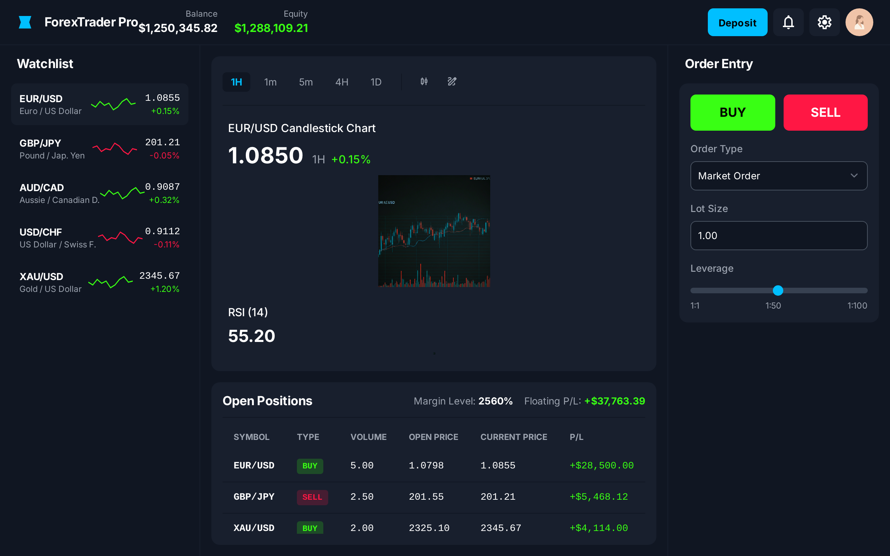
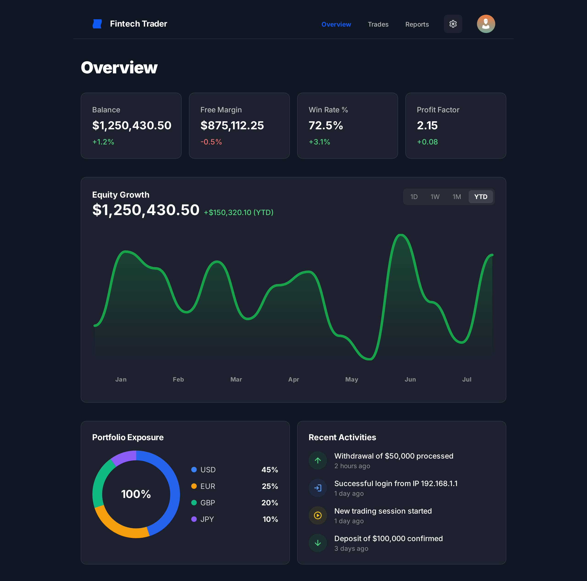

# 📈 Zenix - Institutional Forex Trading Platform


> **Zenix** is a high-performance, simulated Forex trading platform designed with an institutional-grade "Dark Mode" UI. Built to demonstrate real-time data streaming, complex state management, and financial data visualization.

---

## 📸 Screenshots & Demo

*(Tempatkan gambar hasil desain AI atau screenshot aplikasi asli Anda di sini. Gunakan format: ``)*

| Trading Terminal (Main) | User Dashboard |
|:---:|:---:|   
|  |  |

---

## 🚀 About The Project

This project was built to simulate the experience of a professional Forex trader. Unlike typical retail apps, **VeloxTrade** focuses on data density, low-latency updates, and precision.

The goal of this project is to showcase advanced full-stack capabilities, specifically handling **WebSocket streams** for real-time price updates and managing **high-concurrency state** on the frontend without performance degradation.

### Core Concept
*   **Asset Class:** Forex (Major Pairs: EUR/USD, GBP/JPY, etc.) & Gold (XAU/USD).
*   **Design Philosophy:** "Institutional Pro" - Information dense, dark-themed, and eye-strain reduction for long sessions.
*   **Data Source:** Live market data streamed via Binance/CoinGecko public WebSocket APIs (simulated as Forex feeds).

---

## ✨ Key Features

### 🖥️ Frontend (Institutional UI)
*   **Real-time Charting:** High-performance candlestick charts using `TradingView Lightweight Charts`, featuring zoom, pan, and crosshair tools.
*   **Live Order Book:** Dynamic Bid/Ask spread visualization with color-coded price tick updates (Green/Red flash).
*   **Positions Management:** Real-time floating Profit/Loss (PnL) calculation based on live market moves.
*   **Interactive Dashboard:** Equity curve analysis, win-rate statistics, and portfolio exposure charts.
*   **Responsive Design:** Optimized for desktop (dense grid) and mobile (quick execution).

### ⚙️ Backend & Logic
*   **Simulated Matching Engine:** Handles Market execution with instant simulated fills.
*   **Authentication:** Secure JWT-based login/registration system with hashed passwords.
*   **Wallet System:** Double-entry ledger logic to ensure integrity of simulated deposits, withdrawals, and trade balances.
*   **WebSocket Server:** customized `Socket.io` namespace to broadcast price ticks to connected clients efficiently.

---

## 🛠️ Tech Stack

### Frontend
*   **Framework:** [Next.js 14](https://nextjs.org/) (App Router)
*   **Language:** TypeScript
*   **Styling:** Tailwind CSS + Shadcn/ui (for accessible, professional components)
*   **State Management:** Zustand (for high-frequency global state updates)
*   **Visualization:** TradingView Lightweight Charts & Recharts
*   **Data Fetching:** TanStack Query (React Query)

### Backend
*   **Runtime:** Node.js
*   **Framework:** Express.js (or NestJS - *pilih salah satu*)
*   **Database:** PostgreSQL (Relational DB for transactional consistency)
*   **ORM:** Prisma / Drizzle
*   **Real-time:** Socket.io (WebSocket)

### DevOps & Tools
*   **Container:** Docker & Docker Compose
*   **Version Control:** Git & GitHub
*   **Deployment:** Vercel (Frontend) & Railway/Render (Backend)

---

## 🧩 System Architecture

```mermaid
graph TD;
    ExternalAPI[External Market Data API] -->|WebSocket| Backend;
    Backend[Node.js Server] -->|Emit Price Update| Frontend;
    Frontend[Next.js Client] -->|HTTP Request: Order| Backend;
    Backend -->|SQL Transaction| DB[(PostgreSQL)];
    Backend -->|Order Confirmation| Frontend;